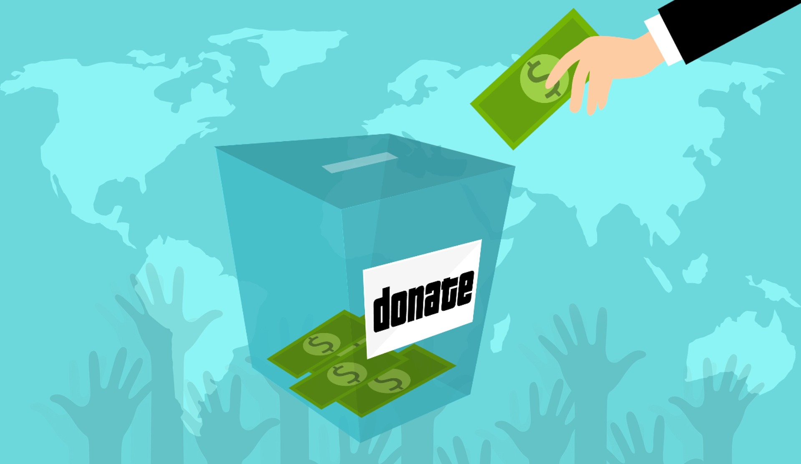

# Excel Challenge

  

### Contains:
* Starterbook_edited.xlsx
* Kickstarter_edited.docx

### Description:
* Starterbook_edited.xlsx: The goal of this excel workbook was to draw out trends from 4,000 past Kickstarter projects. The workbook can be broken into two stages:
- Data Cleanup:
    - Campaigns sheet: _this sheet contains the source data, showing 4,000 Kickstarter campaigns,with their names, descriptions ('blurb'), goal amounts ('goal'), amount donated ('pledged'), status of the campaign ('state'), the country of origin for the campaign, the currency used, the date by which the campaign finished ('deadline'), the start date of the campaign (launched\_at')whether the campaign was a 'staff pick', or was 'spotlighted', the number of people who donated ('backers\_count'), and the category/subcategory the campaign belongs to_
        - using conditional formatting in the 'state' column to show whether a  campaign is successful, failed, cancelled, or live
        - creating a new column, 'Percent Funded', as another way of measuring  campaign success, by showing how close a campaign is to meeting its funding goals
        - creating a new column, 'Average Donation', to show how much, on average, someone donates to a particular campaign
        - splitting the 'Category and Subcategory' column into two columns  ('Category' and 'Sub-category') 
        - converting the Unix timestamp dates in the 'launched_at' and 'deadline' columns to create the 'Date Created Conversion' and 'Date Ended Conversion' columns 

- Data Analysis/Visualisation:
    - PT_Cat (Pivot Table Categories) sheet: 
        
        - pivot table counting how many campaigns are in each state (successful, failed, cancelled, or live), by category, which can be edited to display all, or a selected country's data
        - calculation of percent success per category
        - summary statistics for the category/state table
        - stacked pivot chart of the category/state table
    - PT_SubCat (Pivot Table Sub-categories) sheet: 
        
        - pivot table counting how many campaigns are in each state (successful, failed, cancelled, or live), by sub-category, which can be edited to display all, or a selected country's data
        - percent success per sub-category, with conditional formatting
        - stacked pivot chart of the sub-category/state table
    - PT_Date (Pivot Table Date) sheet:
        

        
        

        - pivot table counting how many campaigns are in each state (successful, failed, cancelled, or live), by date created, which can be edited to display all, or a selected country's data
        - pivot chart of the state/date created table
        - table containing observations on pivot chart when breaking data down by year
    - Goals_Status sheet:
        

        
        

        - table showing status of campaigns by the amount requested ('goal'), and the percentage of each goal grouping that is in each state
    - Goals_Chart sheet:
        
        - pivot table showing status of campaigns by the amount requested ('goal')
        - pivot chart of goals/status table
    - Goals_Stats sheet:
        

        
        

        - table showing the backers_count for successful and failed campaigns 
        - table showing summmary statistics on backers_count/campaign state table

* Kickstarter_edited.docx:
    - discusses observations about the data: 
        - best measure of central tendency
        - variability amongst successful and unsuccessful campaigns
    - conclusions about the sort of projects that are more likely to succeed: 
        - categories of campaign most likely to succeed
        - creation date
        - amount requested
    - potential limitations:
        - representative nature of the data
        - currency used
        - geographical concentration
    - suggested graphs/tables for the dataset:
        - percent funded
        - promotion methods
        - importance of average donation/backers count

